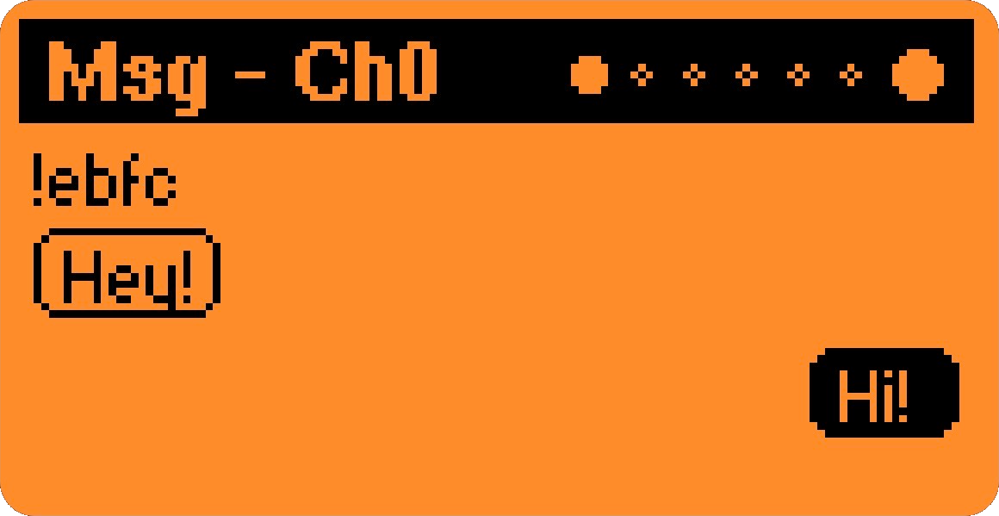
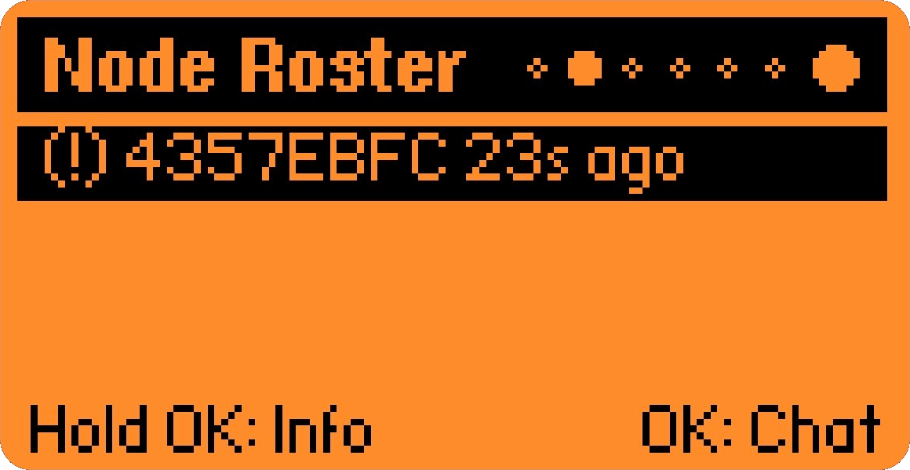
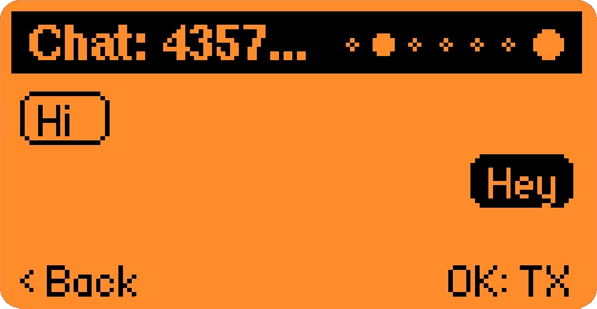
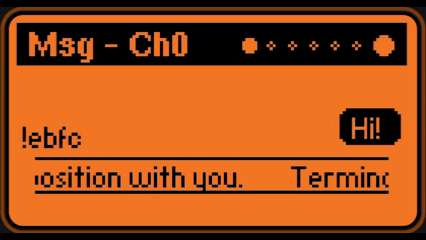
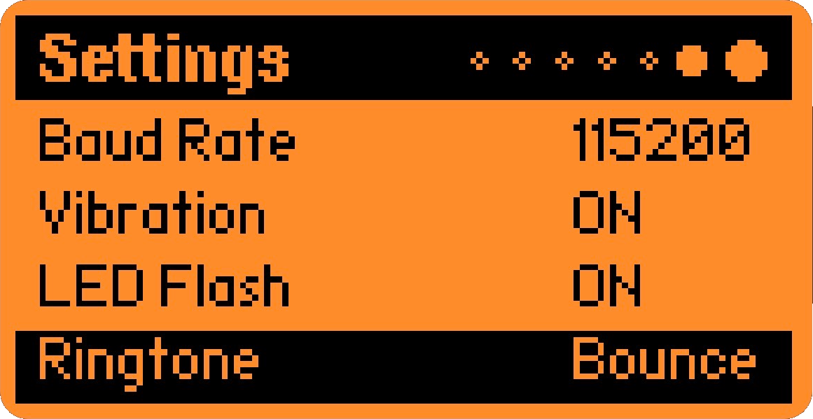
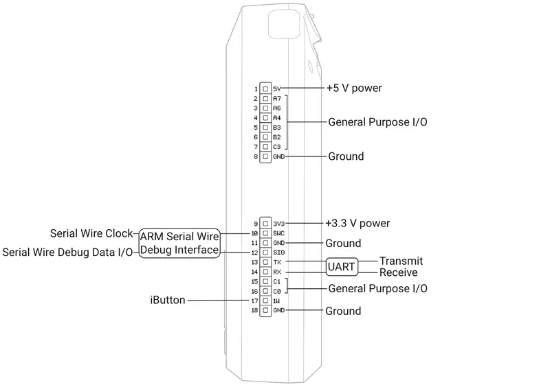

# ZeroMesh Serial

ZeroMesh is a serial interface for the Flipper Zero designed to communicate with Meshtastic nodes. It provides a direct link to a node via UART to monitor network status, manage a node roster, and send or receive messages.



## Power Warning

Do not power a node from USB, battery, or any external supply while it is connected to the Flipper Zero 5V pin.

The 5V pin is an output. Multiple power sources on the same rail will back-feed and can damage the Flipper, the node's regulator, or the USB port.

Use only one power source at a time. Disconnect the Flipper 5V before connecting USB or any other supply.

## Features

### Core Functionality
* **Roster Management**: Tracks discovered nodes, including Signal-to-Noise Ratio (SNR), Received Signal Strength Indicator (RSSI), and telemetry data like battery percentage and voltage.
* **Messaging**: Supports both broadcast and direct private messaging to specific nodes within the roster.
* **Multi-Channel Support**: Switch between up to 8 Meshtastic channels with long-press OK on messages page.
* **UI System**: A multi-page interface featuring message history, node lists, device statistics, signal information, and debug logs.



### Notifications
* **Configurable Alerts**: 19 built-in ringtones including Nokia, SOS, Mario, and more.
* **Hardware Integration**: Vibration motor, LED flash, and speaker notifications.
* **Per-Event Control**: Separate settings for vibration, LED, and audio.

### Display Features
* **Sender Identification**: Messages show sender IDs in !a1b2 format.
* **Smart Text Handling**: Toggle between scrolling and wrapping for long messages.
* **Compact Spacing**: Multiple short messages fit on screen simultaneously.
* **Auto-scroll**: Automatically shows newest messages with manual scroll support.


<p align="center">
  
</p>


*Scroller enabled*

### Settings & Customization
* **Persistent Settings**: All preferences automatically save to SD card.
* **Scroll Controls**: Adjustable speed (1-10) and framerate (1-10) for performance tuning.
* **UART Configuration**: Support for both USART and LPUART with configurable baud rates.



## File Structure

* `zeromesh_serial_app.c`: Application entry point and main loop.
* `zeromesh_gui.c/h`: UI rendering, pagination, and input handling.
* `zeromesh_protocol.c/h`: Framing and Protobuf decoding for the Meshtastic serial protocol.
* `zeromesh_roster.c/h`: Node discovery and direct message routing.
* `zeromesh_uart.c/h`: Hardware serial configuration and stream buffering.
* `zeromesh_history.c/h`: Message storage and system logging.
* `zeromesh_notify.c/h`: Hardware notification triggers and ringtone playback.
* `zeromesh_settings.c/h`: Settings persistence to SD card.
* `zeromesh_channel.c/h`: Multi-channel management.

## Installation

1. Copy the `zeromesh` folder into the `applications_user` directory of your Flipper Zero firmware source.
2. Ensure the `lib/meshtastic_api` and `lib/nanopb` dependencies are present.
3. Open a terminal in the project root and run:
   ```powershell
   ufbt launch
   ```

## Hardware Configuration

### Connection

Connect your Meshtastic node to the Flipper Zero GPIO pins:

* **TX**: Connect to Flipper RX (Pin 13/14 depending on UART selection).
* **RX**: Connect to Flipper TX (Pin 13/14 depending on UART selection).
* **GND**: Ensure a common ground between both devices.

* **5V Optional**: Do not use the USB to power the meshtastic node if you chose to use 5V.


*Source: Flipper Zero Documentation*

### Node Settings

The Meshtastic node must be configured via the CLI or Mobile App:

* **Serial Module**: Enabled.
* **Serial Mode**: `PROTO`.
* **Baud Rate**: 115200.

## Usage

### Navigation
* **Left/Right**: Switch between pages (Messages, Roster, Stats, Signal, Logs, Settings).
* **Up/Down**: Scroll through messages or navigate menus.

### Messages Page
* **OK (short)**: Open text input for broadcasting.
* **OK (long)**: Cycle through channels (if multi-channel configured).
* **Up/Down**: Scroll through message history.

### Roster Page
* **OK (short)**: Start private chat with selected node.
* **OK (long)**: View detailed node information (SNR, RSSI, battery, voltage).
* **Up/Down**: Navigate node list.

### Private Chat
* **OK**: Send direct message to selected node.
* **Up/Down**: Scroll through conversation history.
* **Back**: Return to roster.

### Logs Page
* **OK**: Pause/unpause log stream.
* **Up/Down**: Scroll when paused.

### Settings Page
* **OK**: Enter edit mode for selected setting.
* **Left/Right**: Adjust value while editing.
* **OK/Back**: Exit edit mode.

Settings automatically save when changed.

## Configuration Options

### Notification Settings
* **Vibration**: ON/OFF
* **LED Flash**: ON/OFF  
* **Ringtone**: 19 options (Off, Short, Double, Triple, Long, SOS, Chirp, Nokia, Descend, Bounce, Alert, Pulse, Siren, Beep3, Trill, Mario, LevelUp, Metric, Minimal)

### Display Settings
* **Scroll Speed**: 1-10 (controls animation speed)
* **Scroll FPS**: 1-10 (controls refresh rate, lower = better battery)
* **Long Message Handling**: Scroll or Wrap

### UART Settings
* **Port**: USART or LPUART
* **Baud Rate**: 9600, 19200, 38400, 57600, 115200, 230400, 460800, 921600

## Troubleshooting

### No Data Received
1. Check serial connections (TX/RX not swapped).
2. Verify node serial mode is set to `PROTO`.
3. Confirm baud rate matches on both devices (115200 default).

### Messages Not Displaying
1. Check UART settings in Settings page.
2. View Logs page to confirm data reception.
3. Verify Meshtastic node is properly configured.

### Settings Not Saving
1. Ensure SD card is inserted and mounted.
2. Check `/ext` folder exists on SD card.
3. Try deleting `/ext/zeromesh/settings.cfg` and restart.

## License

This project is licensed under the GNU General Public License v3.0 (GPL-3.0).
## Credits / Upstream

This project interoperates with and/or uses components from:

- Meshtastic
  - Upstream: https://github.com/meshtastic/firmware
  - License: GPL-3.0
  - Used for: Meshtastic serial protocol + protobuf schema compatibility

- Flipper Zero Firmware (Flipper Devices)
  - Upstream: https://github.com/flipperdevices/flipperzero-firmware
  - License: GPL-3.0
  - Used for: Flipper Zero SDK / application build environment

- Nanopb (Protocol Buffers for embedded C)
  - Upstream: https://github.com/nanopb/nanopb
  - License: zlib
  - Used for: protobuf encoding/decoding

