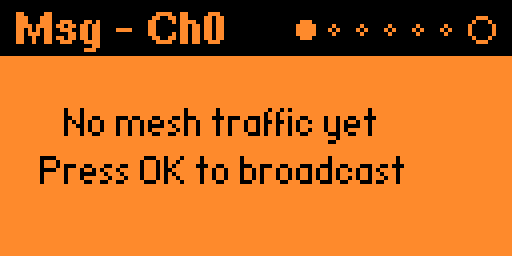
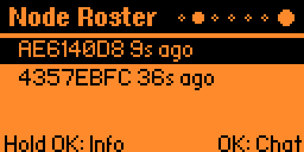
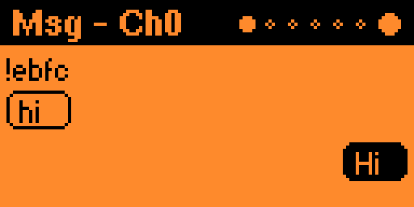
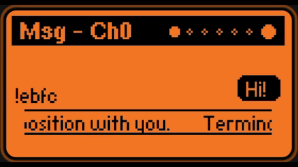
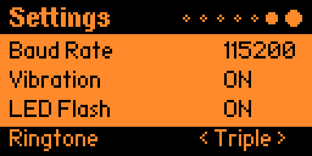
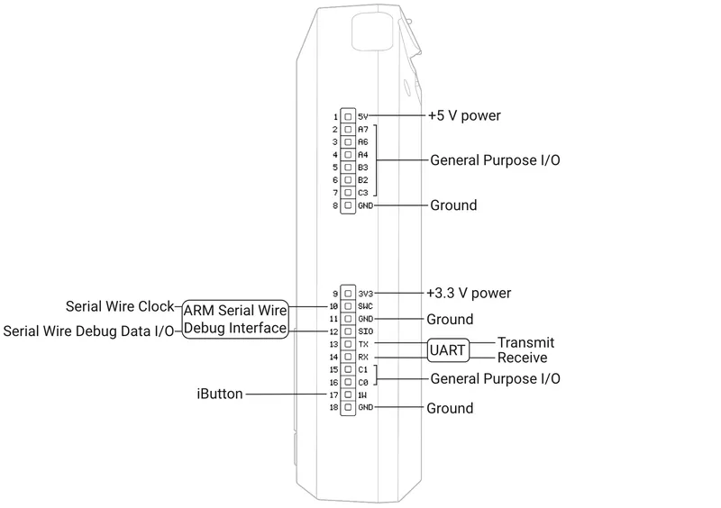

# ZeroMesh

ZeroMesh is a Meshtastic serial interface for the Flipper Zero. It connects to a node over UART and gives you a live view of the mesh: incoming messages, node roster, signal stats, and device telemetry, all from the Flipper's screen.



## Power Warning

Do not power a node from USB, battery, or any external supply while it is connected to the Flipper Zero 5V pin.

The 5V pin is an output. Multiple power sources on the same rail will back-feed and can damage the Flipper, the node's regulator, or the USB port.

Use only one power source at a time. Disconnect the Flipper 5V before connecting USB or any other supply.

## Features

The app is built around a multi-page UI (Messages, Roster, Stats, Signal, Logs, and Settings) navigated with left and right. The roster tracks every node that's announced itself on the network, showing SNR, RSSI, battery percentage, and voltage. From there you can either broadcast to the primary channel or open a direct private chat with any individual node.



Multi-channel is supported. Long-pressing OK on the Messages page cycles through up to 8 configured channels, with the current channel shown in the header.

Notifications are fully configurable. Vibration, LED flash, and audio are all independent toggles, with 19 built-in ringtones ranging from a short beep to Nokia, Mario, and SOS.

Messages show the sender's node ID in !a1b2 format above each bubble. Long messages can either scroll across the screen or wrap to multiple lines depending on your preference, and the display compacts short messages so more fit on screen at once. New messages auto-scroll into view, but you can scroll back manually at any time.


<p align="center">
  
</p>

*Scroller enabled*

All settings persist to `/ext/zeromesh/settings.cfg` on the SD card automatically, nothing needs saving manually. UART port and baud rate are configurable, with support for both USART and LPUART.



## Installation

1. Copy the `zeromesh` folder into the `applications_user` directory of your Flipper Zero firmware source.
2. Ensure the `lib/meshtastic_api` and `lib/nanopb` dependencies are present.
3. Open a terminal in the project root and run:
   ```powershell
   ufbt launch
   ```

## Hardware Configuration

### Connection

Connect your Meshtastic node to the Flipper Zero GPIO pins:

* **TX**: Connect to Flipper RX (Pin 13/14 depending on UART selection).
* **RX**: Connect to Flipper TX (Pin 13/14 depending on UART selection).
* **GND**: Ensure a common ground between both devices.
* **5V Optional**: Do not use the USB to power the meshtastic node if you chose to use 5V.


*Source: Flipper Zero Documentation*

### Node Settings

The Meshtastic node must be configured via the CLI or Mobile App:

* **Serial Module**: Enabled.
* **Serial Mode**: `PROTO`.
* **Baud Rate**: 115200.

## Usage

### Navigation
* **Left/Right**: Switch between pages (Messages, Roster, Stats, Signal, Logs, Settings).
* **Up/Down**: Scroll through messages or navigate menus.

### Messages Page
* **OK (short)**: Open text input for broadcasting.
* **OK (long)**: Cycle through channels (if multi-channel configured).
* **Up/Down**: Scroll through message history.

### Roster Page
* **OK (short)**: Start private chat with selected node.
* **OK (long)**: View detailed node information (SNR, RSSI, battery, voltage).
* **Up/Down**: Navigate node list.

### Private Chat
* **OK**: Send direct message to selected node.
* **Up/Down**: Scroll through conversation history.
* **Back**: Return to roster.

### Logs Page
* **OK**: Pause/unpause log stream.
* **Up/Down**: Scroll when paused.

### Settings Page
* **OK**: Enter edit mode for selected setting.
* **Left/Right**: Adjust value while editing.
* **OK/Back**: Exit edit mode.

Settings automatically save when changed.

## Configuration Options

### Notification Settings
* **Vibration**: ON/OFF
* **LED Flash**: ON/OFF
* **Ringtone**: 19 options (Off, Short, Double, Triple, Long, SOS, Chirp, Nokia, Descend, Bounce, Alert, Pulse, Siren, Beep3, Trill, Mario, LevelUp, Metric, Minimal)

### Display Settings
* **Scroll Speed**: 1-10 (controls animation speed)
* **Scroll FPS**: 1-10 (controls refresh rate, lower = better battery)
* **Long Message Handling**: Scroll or Wrap

### UART Settings
* **Port**: USART or LPUART
* **Baud Rate**: 9600, 19200, 38400, 57600, 115200, 230400, 460800, 921600

## Troubleshooting

### No Data Received
1. Check serial connections (TX/RX not swapped).
2. Verify node serial mode is set to `PROTO`.
3. Confirm baud rate matches on both devices (115200 default).

### Messages Not Displaying
1. Check UART settings in Settings page.
2. View Logs page to confirm data reception.
3. Verify Meshtastic node is properly configured.

### Settings Not Saving
1. Ensure SD card is inserted and mounted.
2. Check `/ext` folder exists on SD card.
3. Try deleting `/ext/zeromesh/settings.cfg` and restart.

## License

This project is licensed under the GNU General Public License v3.0 (GPL-3.0).

## Credits

This project interoperates with and/or uses components from:

- Meshtastic
  - Upstream: https://github.com/meshtastic/firmware
  - License: GPL-3.0
  - Used for: Meshtastic serial protocol + protobuf schema compatibility

- Flipper Zero Firmware (Flipper Devices)
  - Upstream: https://github.com/flipperdevices/flipperzero-firmware
  - License: GPL-3.0
  - Used for: Flipper Zero SDK / application build environment

- Nanopb (Protocol Buffers for embedded C)
  - Upstream: https://github.com/nanopb/nanopb
  - License: zlib
  - Used for: protobuf encoding/decoding
